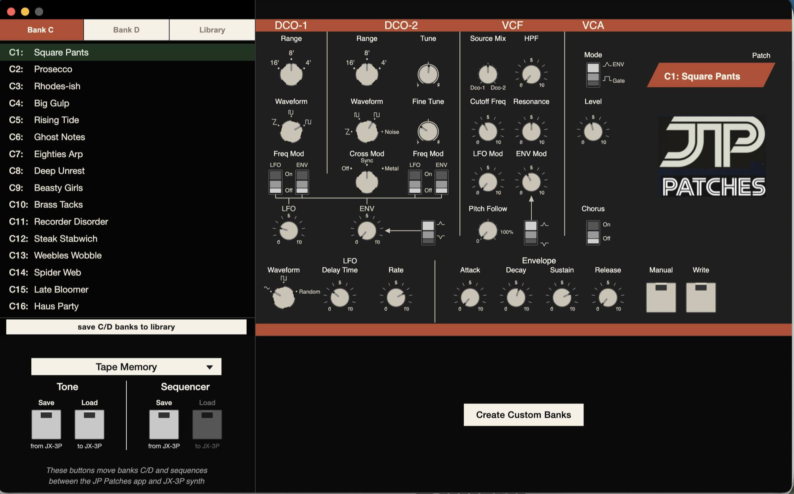
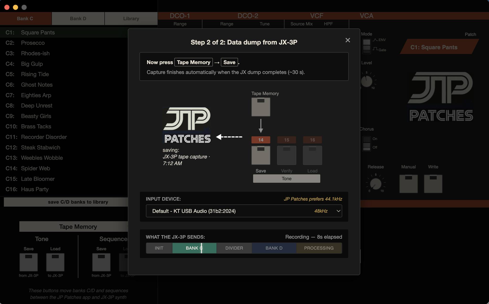
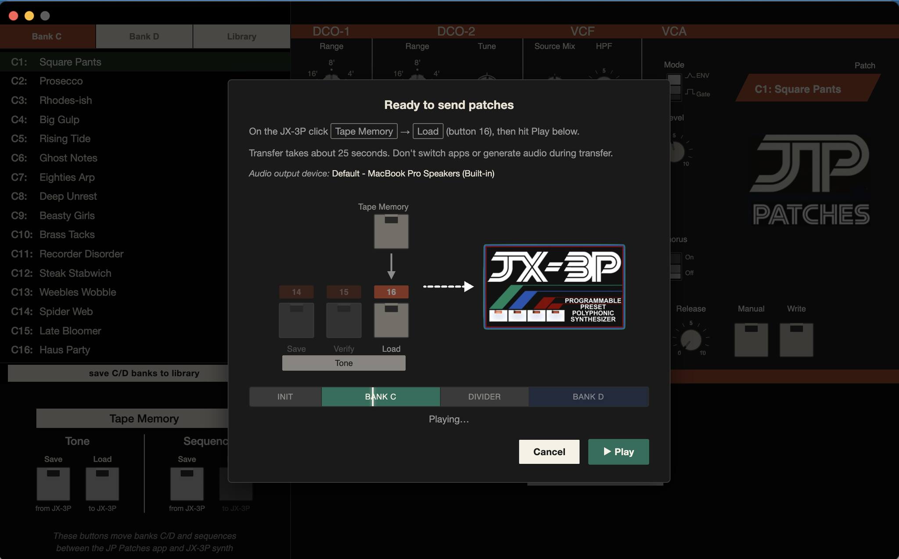
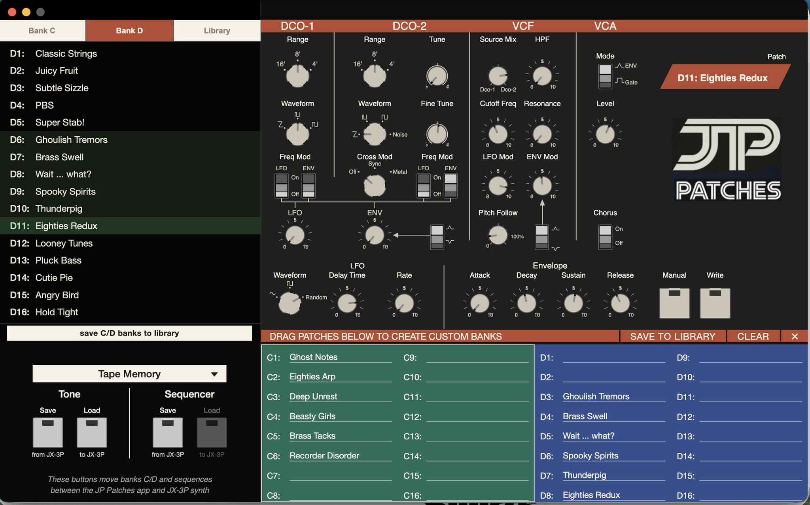
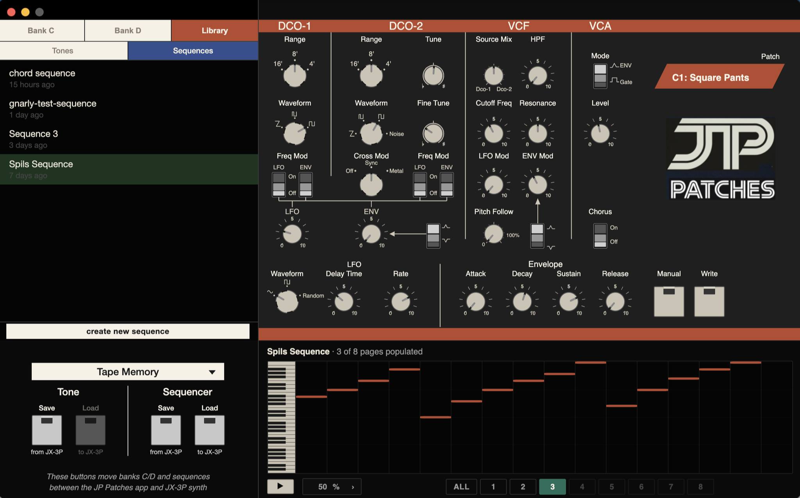
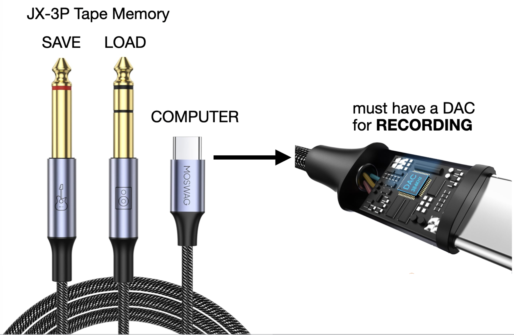

Hello JX-3People.

I've owned the JX-3P since it was released. I bought it at Down Home Guitar in Anchorage, Alaska, as a freshman in high school. I own many synths, but have kept and played the JX-3P since that time.

I've always wanted a way to easily save patches to my computer. But the JX relies on outdated tape dump technology — think, the hiss, chirp and screech of an ‘80s dial-up modem + audio cassette tape as memory!  I couldn't find a program so I decided to build my own. This was also an excuse to figure out how to "vibe code" — something I knew nothing about until I began in May of 2026.

[JP Patches for macOS](https://github.com/danielspils/JP-Patches-App/releases/latest){:.btn-red}

Fast forward a month and I have a beta version of JP Patches, my JX-3P companion app. It works on macOS 12+ on Apple Silicon (arm64) at the moment. It doesn't yet support MIDI — the stock JX-3P MIDI does not support SysEx. I'll wire up support for the Series Circuits MIDI Upgrade Kit in a future release. JP Patches operates through tape dumps using a single cord.

## WHAT CAN JP PATCHES DO?
* transfer patches JX ⇄ JP
* transfer sequences JX ⇄ JP
* build custom patch banks w/ drag & drop reorder
* custom patch names (e.g. rename C1 as "Warm Pad")
* sequencer with edit, save and audio playback
* library for saving & naming C/D banks & sequences
* fully functional PG-200 dashboard
* other features I'm forgetting ...

  
  
  
  

## HOW DOES IT WORK?

* use this [USB-to-1/4-splitter cable](https://www.amazon.com/dp/B0G43JQJXT)
* plug the TS end into Tape Memory/Save
* plug the TRS end into Tape Memory/Load
* plug the USB C end into a Mac 

[JP Patches for macOS](https://github.com/danielspils/JP-Patches-App/releases/latest){:.btn-green}

## FISHING FOR FEEDBACK

Friends have successfully loaded JP Patches, but none are synth people so they just say, "looks cool dude — congrats!" If you are a JX-3P enthusiast, I'd invite your feedback.

I've been using JP Patches for the past few weeks. It works fantastic—but it's just me using it. I send C/D banks back-and-forth between my computer and JX. I send sequences. I edit sequences within the app, save 'em, and send back to my JX. I create custom names for my personal JX C/D banks. I turn knobs on the PG-200 onscreen because it's fun (it'll be more fun when MIDI is working). I went ahead and seeded JP Patches with my personal patches and a sequence I wrote so a new user of the software will see something upon initial download. In the future I envision JX users easily trading patch banks, sequences, and enjoying the JX-3P with the modern conveniences of software.

[JP Patches for macOS](https://github.com/danielspils/JP-Patches-App/releases/latest){:.btn-blue}

  <iframe src="https://www.youtube-nocookie.com/embed/ztEHTNLF7LQ"
          title="JP Patches — demo"
          frameborder="0"
          allow="accelerometer; clipboard-write; encrypted-media; gyroscope; picture-in-picture; web-share"
          referrerpolicy="strict-origin-when-cross-origin"
          allowfullscreen></iframe>

You’re either a JX-3P owner or terribly bored if you’ve read this far. I’ve never written software, let alone software for a 1983 relic that has somehow held my attention all these years. If it’s not obvious at this point, this is personal passion project (3P!). *— Daniel Spils*
